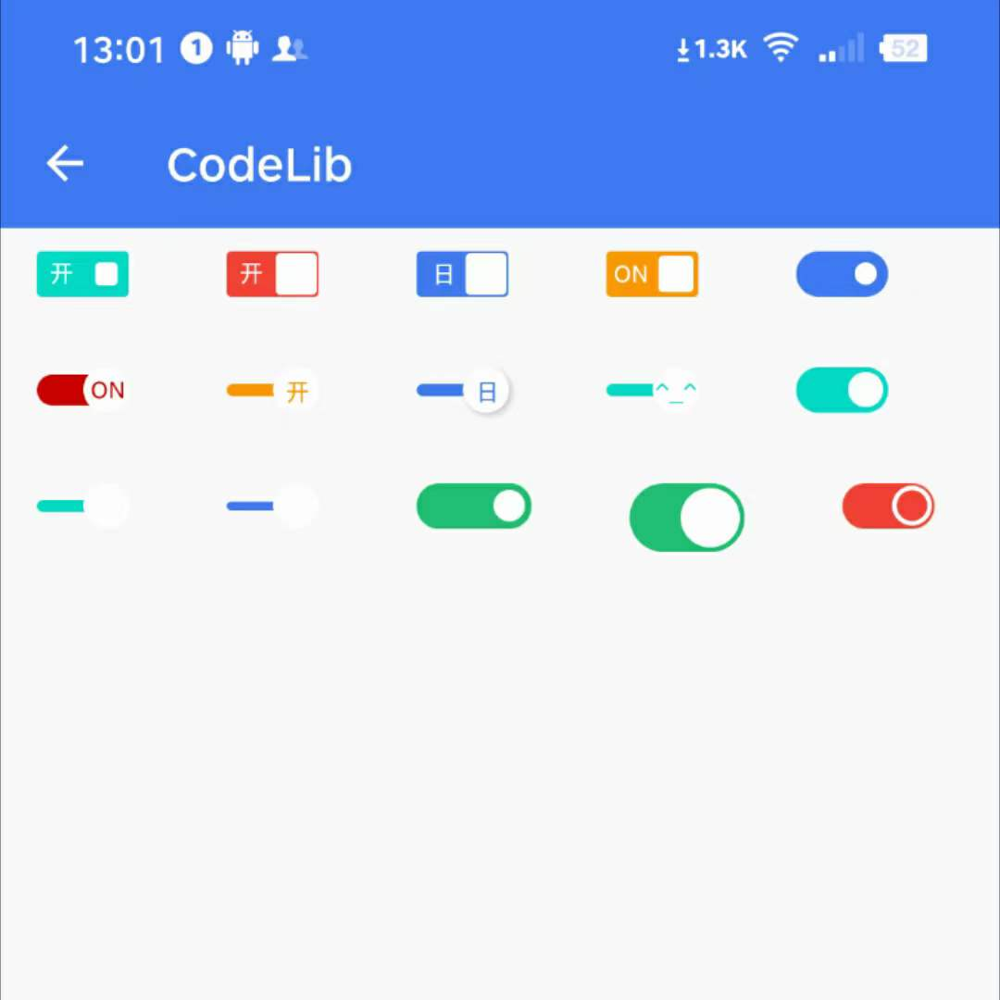

# CommonWidget

常用的自定义View控件库

### 集成：

```
dependencies {
    implementation 'io.github.student9128:commonwidget:1.0.1'
}
```

### ToggleView



以下是ToggleView的属性

| 属性                     | 类型                 | 默认值     |
| :----------------------- | :------------------- | :--------- |
| toggleColor              | color                | 0xffffffff |
| toggleCheckedColor       | color                | 0xffff6363 |
| toggleUnCheckedColor     | color                | 0xffebebeb |
| toggleBorderWidth        | imension             | 2dp        |
| toggleShadow             | boolean              | false      |
| toggleShowText           | string               | false      |
| toggleCheckedText        | string               | ON         |
| toggleUnCheckedText      | string               | OFF        |
| toggleCheckedTextColor   | color                | 0xffff6363 |
| toggleUnCheckedTextColor | color                | 0xff444444 |
| toggleType               | enum:                | circle     |
| toggleType包括的值       | rectangle            |            |
|                          | circle               |            |
|                          | circleWithThin       |            |
|                          | circleWithThinner    |            |
|                          | circleWithThin       |            |
|                          | circleWithConcentric |            |

